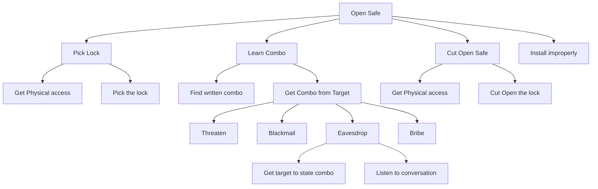

# Threat Modeling: Attack Graphs Technique

**[< Previous: Goals](../goals.md)**

Once you understand the potential attacker(s) and a goal, it is helpful to think through the ways in which they could achieve this.

hile you can just sit and do this in whatever way you want, it is often useful to reason about this by brainstorming using a tool called an Attack Graph. This is also called an Attack Tree, Threat Tree, or Threat Graph in some literature.

An attack tree has at the top (which is called the root node), the goal of the attacker.

For example, the attack tree below has “Open Safe” as the root node, so this is the attacker’s goal. The nodes in the tree (i.e., the square boxes) are connected by one or more edges (the lines between boxes). For two nodes that have an edge, the higher node is called the parent and the lower node is the child. The child node or nodes are more details about how to achieve the parent node.

**[> Next Up: Not All Attacks are the Same](./not-all-attacks.md)**
